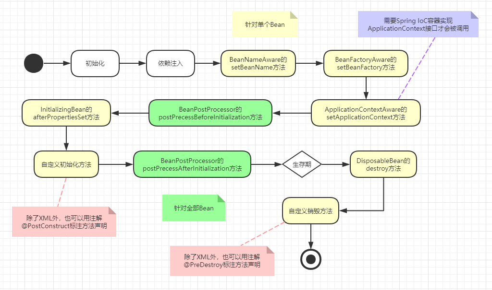

## Spring练习

### 1、Hello World

- 传统方式创建对象，组装依赖关系

- 使用Spring的BeanFactory获取对象

- 模拟Spring容器创建对象（反射 + 内省机制）

- 使用 **import** 导入其他配置文件：

  ```xml
  <?xml version="1.0" encoding="UTF-8"?>
  <beans xmlns="http://www.springframework.org/schema/beans"
         xmlns:xsi="http://www.w3.org/2001/XMLSchema-instance"
         xsi:schemaLocation="http://www.springframework.org/schema/beans
                             http://www.springframework.org/schema/beans/spring-beans.xsd">
      <import resource="classpath:cn/huangxulin/spring/hello.xml"/>
  </beans>
  ```

### 2、Spring测试

- JUnit4测试

```java
// 运行Spring的JUnit4
@RunWith(SpringJUnit4ClassRunner.class)

// 上下文配置对象（配置文件）
// @ContextConfiguration("classpath:cn/huangxulin/spring/springTest.xml")

// ContextConfiguration 注解后的参数可以省略
// 		1) 此时配置文件应和测试类放在同一目录
//      2) 配置文件名为：测试类名-context.xml
// SpringTest-context.xml
@ContextConfiguration
public class SpringTest {
    
}
```

- JUnit5测试

```java
// 1) 配置文件和测试类放在同一目录
// 2) 配置文件名为：测试类名-context.xml
// SpringJUnit5Test-context.xml
@SpringJUnitConfig
public class SpringJUnit5Test {
    
}
```

### 3、BeanFactory 和 ApplicationContext

- **BeanFactory**

```java
Resource resource = new ClassPathResource("cn/huangxulin/spring/container.xml");
BeanFactory factory = new XmlBeanFactory(resource);
System.out.println("-------------------------");
Person p = factory.getBean("person", Person.class);
System.out.println(p);
```

输出：

```
-------------------------
构建 Person ...
cn.huangxulin.spring.Person@6591f517
```

BeanFactory有延迟初始化（懒：lazy）的特点，创建Spring容器的时候，不会立马去创建容器中管理的Bean对象，而是要等到从容器中去获取对象的时候，才去创建对象。

- **ApplicationContext**

```java
ApplicationContext ctx = new ClassPathXmlApplicationContext("cn/huangxulin/spring/container.xml");
System.out.println("-------------------------");
Person p = ctx.getBean("person", Person.class);
System.out.println(p);
```

输出：

```
构建 Person ...
-------------------------
cn.huangxulin.spring.Person@161479c6
```

使用ApplicationContext创建Spring容器的时候，会把容器中管理的Bean立即初始化，而不会等到获取Bean的时候才去初始化。

> 是否延迟初始化可以在配置文件中进行配置（lazy-init）
>
> ```html
> <bean id="person" class="cn.huangxulin.spring.Person" lazy-init="default" />
> ```
> 全局配置（default-lazy-init）
>
> ```html
> <beans xmlns="http://www.springframework.org/schema/beans"
>        xmlns:xsi="http://www.w3.org/2001/XMLSchema-instance"
>        xsi:schemaLocation="http://www.springframework.org/schema/beans
>                            http://www.springframework.org/schema/beans/spring-beans.xsd"
>        default-lazy-init="true">
> </beans>
> ```

### 4、Spring Bean 的生命周期



```java
@Data
public class JuiceMaker2 implements BeanNameAware, BeanFactoryAware, ApplicationContextAware, InitializingBean, DisposableBean {

    private String beverageShop;

    private Source source;

    public void init() {
        System.out.println("【" + this.getClass().getSimpleName() + "】执行自定义初始化方法");
    }

    public void myDestroy() {
        System.out.println("【" + this.getClass().getSimpleName() + "】执行自定义销毁方法");
    }

    public String makeJuice() {
        return "这是一杯由" + beverageShop + "饮品店, 提供的" + source.getSize() + source.getSugar() + source.getFruit();
    }

    @Override
    public void setBeanName(String name) {
        System.out.println("【" + this.getClass().getSimpleName() + "】调用 BeanNameAware 接口的 setBeanName 方法");
    }

    @Override
    public void setBeanFactory(BeanFactory beanFactory) throws BeansException {
        System.out.println("【" + this.getClass().getSimpleName() + "】调用 BeanFactoryAware 接口的 setBeanFactory 方法");
    }

    @Override
    public void setApplicationContext(ApplicationContext applicationContext) throws BeansException {
        System.out.println("【" + this.getClass().getSimpleName() + "】调用 ApplicationContextAware 接口的 setApplicationContext 方法");
    }

    @Override
    public void afterPropertiesSet() throws Exception {
        System.out.println("【" + this.getClass().getSimpleName() + "】调用 InitializingBean 接口的 afterPropertiesSet 方法");
    }

    @Override
    public void destroy() throws Exception {
        System.out.println("【" + this.getClass().getSimpleName() + "】调用接口 DisposableBean 的 destroy 方法");
    }

}
```

输出结果：

```
【Source】对象source开始实例化
【Source】对象source实例化完成
【JuiceMaker2】调用 BeanNameAware 接口的 setBeanName 方法
【JuiceMaker2】调用 BeanFactoryAware 接口的 setBeanFactory 方法
【JuiceMaker2】调用 ApplicationContextAware 接口的 setApplicationContext 方法
【JuiceMaker2】对象juiceMaker2开始实例化
【JuiceMaker2】调用 InitializingBean 接口的 afterPropertiesSet 方法
【JuiceMaker2】执行自定义初始化方法
【JuiceMaker2】对象juiceMaker2实例化完成
这是一杯由贡茶饮品店, 提供的大杯少糖橙汁
【JuiceMaker2】调用接口 DisposableBean 的 destroy 方法
【JuiceMaker2】执行自定义销毁方法
```

关于 Spring Bean 生命周期的介绍，参考文章：

- [Spring IoC容器](https://huangxulin.cn/2019/01/15/spring-ioc-container/)

- [Spring Bean 生命周期](https://github.com/crossoverJie/JCSprout/blob/master/MD/spring/spring-bean-lifecycle.md)

### 5、Bean 的四种实例化方式

#### 5.1 构造器实例化（无参数构造器），最标准，使用最多

```java
public class Cat1 {
    public Cat1() {
        System.out.println("构建Cat1...");
    }
}
```

   ```xml
<!-- Spring Bean 配置 -->
<bean id="cat1" class="cn.huangxulin.spring...Cat1" />
   ```

测试代码：

```java
@Autowired
private Cat1 c1;

@Test
void test1() {
    System.out.println(c1);
}
```

#### 5.2 静态工厂实例化，解决系统遗留问题

```java
public class Cat2 {

}
```

```java
// 静态工厂，工厂方法属于类，使用 static 修饰
public class Cat2Factory {
    public static Cat2 createInstance() {
        Cat2 c2 = new Cat2();
        // TODO
        return c2;
    }
}
```

**配置文件配置工厂类，其中 `factory-method` 指定工厂方法。**

```xml
<bean id="cat2" class="cn.huangxulin...Cat2Factory" factory-method="createInstance" />
```

测试代码：

```java
@Autowired
private Cat2 c2;

@Test
void test2() {
    System.out.println(c2);
}
```

#### 5.3 实例工厂实例化，解决系统遗留问题

```java
public class Cat3 {

}
```

```java
// 实例工厂，工厂方法属于对象，没有 static 修饰
public class Cat3Factory {
    public Cat3 createInstance() {
        Cat3 c3 = new Cat3();
        // TODO
        return c3;
    }
}
```
**配置文件配置工厂类和实体类，实体类的 `factory-bean` 指定工厂类，`factory-method` 指定工厂方法。**

```xml
<bean id="cat3Factory" class="cn.huangxulin...Cat3Factory" />

<bean id="cat3" factory-bean="cat3Factory" factory-method="createInstance" />
```

测试代码：

```java
@Autowired
private Cat3 c3;

@Test
void test3() {
    System.out.println(c3);
}
```

#### 5.4 实现 FactoryBean 接口

实现工厂变种，如集成MyBatis框架使用：`org.mybatis.spring.SqlSessionFactoryBean`

```java
public class Cat4 {

}
```

```java
/**
 * 功能描述: 实现 FactoryBean 接口
 *
 * 该方法可以理解为实例工厂的变种，以接口中的 getObject 方法来规范 factory-method 的方法名
 *
 * @author hxulin
 */
public class Cat4Factory implements FactoryBean<Cat4> {
    
    // 相当于实例工厂的 factory-method
    @Override
    public Cat4 getObject() throws Exception {
        Cat4 c4 = new Cat4();
        // TODO
        return c4;
    }

    @Override
    public Class<?> getObjectType() {
        return Cat4.class;
    }
}
```

这里配置的是工厂类，实际是工厂生成的对象，**工厂方法约定为 getObject，所以无需配置**：

```xml
<bean id="cat4" class="cn.huangxulin...Cat4Factory" />
```

### 6、Bean 的作用域

在 Spring 容器中是指其创建的 Bean 对象相对于其他的 Bean 对象的请求可见范围。

```xml
<bean id="" class="" scope="作用域" />
```

- **singleton**：单例，在 Spring IoC 容器中仅存在一个 Bean 实例（**默认的 scope**）

- **prototype**：多例，每次从容器中获取 Bean 时，都返回一个新的实例，即每次调用 getBean() 时，相当于执行 new XxxBean()，**不会在容器启动时创建对象**。

- request：用于 Web 开发，将 Bean 放入 request 范围，request.setAttribute("xxx")，在同一个 request 获得同一个 Bean

- session：用于 Web 开发，将 Bean 放入 session 范围，在同一个 session 中获得同一个 Bean

- globalSession：一般用于 Porlet 应用环境，分布式系统存在全局 session 概念（单点登录），如果不是 porlet 环境，globalSession 等同于 session

- application：Scopes a single bean definition to the lifecycle of a `ServletContext`. Only valid in the context of a web-aware Spring `ApplicationContext`.

- websocket：Scopes a single bean definition to the lifecycle of a `WebSocket`. Only valid in the context of a web-aware Spring `ApplicationContext`.

Spring5 开始出现 websocket，globalSession 作废。

**在开发中主要使用 scope=“singleton”、scope=“prototype”**

**总结：对于 Struts1 中的 Action 使用 request，Struts2 中的 Action 使用 prototype 类型，其他使用 singleton**

### 7、Bean 的初始化和销毁

比如 DataSource，SqlSessionFactory 最终都需要关闭资源：在 Bean 销毁之前，都要调用 close 方法。

```xml
<bean id="dataSource" class="cn.huangxulin.spring._07_lifecycle.MyDataSource"
      init-method="该类中的初始化方法名"
      destroy-method="该类中销毁方法名" />
```

- init-method：Bean 生命周期的初始化方法，**在构造器执行之后，立即执行**
- destroy-method：**Spring 容器正常关闭的时候**，如果 Bean 被容器管理，会调用该方法

**手动关闭 Spring 容器的几种方式：**

1. 调用容器对象 `close` 方法关闭

   ```java
   @Test
   void test() {
       ClassPathXmlApplicationContext ctx = new ClassPathXmlApplicationContext(".../AppTest-context.xml");
       // TODO
       ctx.close();
   }
   ```

2. 使用 Lombok 的 `@Cleanup` 注解

   ```java
   @Test
   void test2() {
       @Cleanup
       ClassPathXmlApplicationContext ctx = new ClassPathXmlApplicationContext(".../AppTest-context.xml");
       // TODO
   }
   ```

3. 调用容器对象的 `registerShutdownHook` 方法关闭（**推荐使用**）

   这种方式是**把 Spring 线程作为 JVM 的子线程**，JVM 关闭前，会关闭 Spring 容器

   ```java
   @Test
   void test3() {
       ClassPathXmlApplicationContext ctx = new ClassPathXmlApplicationContext(".../AppTest-context.xml");
       // TODO
       ctx.registerShutdownHook();
   }
   ```

### 8、~~XML 自动装配~~（不推荐使用）

```xml
<bean id="" class="" autowire="byType" />
```

### 9、setter 方法注入

- 常量类型注入
- 对象类型注入
- 集合类型注入
  - Set 类型
  - List 类型
  - 数组类型
  - Map 类型
  - Properties 类型

> 拓展：p 命名空间

### 10、构造器注入

#### 10.1 定位构造器的参数可以通过 index、type、name 等属性，推荐使用 name 

```java
public class Employee2 {

    private String name;

    private Integer age;

    private BigDecimal salary;

    public Employee2(String name, Integer age, BigDecimal salary) {
        this.name = name;
        this.age = age;
        this.salary = salary;
    }

    // toString...
}
```

```xml
<bean id="employee2" class="cn.huangxulin.spring._10_di_constructor.Employee2">

    <!--<constructor-arg index="0" value="Castle"/>
        <constructor-arg index="1" value="19" />
        <constructor-arg index="2" value="800" />-->

    <!--<constructor-arg type="java.lang.String" value="Castle"/>
        <constructor-arg type="java.lang.Integer" value="19" />
        <constructor-arg type="java.math.BigDecimal" value="800" />-->

    <constructor-arg name="name" value="Castle"/>
    <constructor-arg name="age" value="19" />
    <constructor-arg name="salary">
        <null />
    </constructor-arg>

</bean>
```

#### 10.2 内部 Bean 注入：

- **Java 代码中可以通过 `@Autowired` 获取 cat2 对象：**

  ```java
  <bean id="cat2" class="cn.huangxulin...Cat2" />
  
  <bean id="person2" class="cn.huangxulin...Person2">
      <constructor-arg name="cat2" ref="cat2" />
  </bean>
  ```

- **私有化处理，让 cat2 对象只服务于 person2 对象，不能直接通过 `@Autowired` 获取 cat2 对象：**

  ```xml
  <bean id="person2" class="cn.huangxulin...Person2">
      <constructor-arg>
          <bean class="cn.huangxulin...Cat2" />
      </constructor-arg>
  </bean>
  ```

### 11、Bean 元素的继承（本质：XML 配置的拷贝）

多个 bean 元素共同配置的抽取，实则是 bean 配置的拷贝，和 Java 的继承不同。

Java 的继承：把多个类共同的代码抽取到父类中。

bean元素的继承（**inheritance**）：把多个 bean 元素共同的属性配置抽取到另一个公用的 bean 元素中。

**注意配置中 abstract、parent 等属性的使用：**

```xml
<!-- 多个 bean 共同配置的抽取 -->
<bean id="baseBean" abstract="true">
    <property name="name" value="Castle" />
    <property name="age" value="19" />
</bean>

<!-- 配置 SomeBean1 -->
<bean id="someBean1" class="cn.huangxulin...SomeBean1" parent="baseBean">
    <property name="color" value="red" />
</bean>

<!-- 配置 SomeBean2 -->
<bean id="someBean2" class="cn.huangxulin...SomeBean2" parent="baseBean">
    <property name="weight" value="60" />
</bean>
```

### 12、属性占位符（property-placeholder）

**引入context命名空间，加载 properties 配置文件**

```properties
jdbc.driverClassName=org.h2.Driver
jdbc.url=jdbc:h2:mem:test
jdbc.username=root
jdbc.password=test
jdbc.initialSize=2
```

```xml
<?xml version="1.0" encoding="UTF-8"?>
<beans xmlns="http://www.springframework.org/schema/beans"
       xmlns:xsi="http://www.w3.org/2001/XMLSchema-instance"
       xmlns:context="http://www.springframework.org/schema/context"
       xsi:schemaLocation="http://www.springframework.org/schema/beans
            http://www.springframework.org/schema/beans/spring-beans.xsd
            http://www.springframework.org/schema/context
            http://www.springframework.org/schema/context/spring-context.xsd">

    <!-- 从 classpath 根路径加载 db.properties 文件 -->
    <context:property-placeholder location="classpath:db.properties" system-properties-mode="NEVER" />

    <!-- 配置一个 Druid 的连接池 -->
    <bean id="dataSource" class="com.alibaba.druid.pool.DruidDataSource" init-method="init" destroy-method="close">
        <property name="driverClassName" value="${jdbc.driverClassName}" />
        <property name="url" value="${jdbc.url}" />
        <property name="username" value="${jdbc.username}" />
        <property name="password" value="${jdbc.password}" />
        <property name="initialSize" value="${jdbc.initialSize}" />
    </bean>

</beans>
```

> system-properties-mode="NEVER"，防止加载系统属性。如：**在 Windows 系统下，使用 ${username} 获取属性值时，有可能获取的是 Windows 系统的用户名而非 properties 文件中的数据。**

### 13、`@Autowired` 和 `@Qualifier`

- **配置 `@Autowired` 注解解析器（测试环境可以不配置，JavaWeb环境一定要配置）**

  ```xml
  <!-- DI 注解解析器，使其支持 @Autowired 注解 -->
  <context:annotation-config />
  ```

- **配置 `@Autowired` 的 require 为 false，找不到 bean 时注入空值， `@Qualifier` 用于指定配置文件中 bean 的 id**

  ```java
  @Autowired(required = false)	// 找不到bean时忽略，让对象为NULL
  @Qualifier("cat222")
  private Cat cat;
  ```

### 14、`@Value` 

`@Autowired` 和 `@Resource` 注解用于注入对象，`@Value` 注解用于注入常量数据（简单类型数据）。

> **拓展：引入多个 properties 文件。**
>
> ```xml
> <context:property-placeholder location="classpath:db.properties,classpath:server.properties" />
> ```
>
> 或者：
>
> ```xml
> <context:property-placeholder location="classpath:db.properties" ignore-unresolvable="true" />
> <context:property-placeholder location="classpath:server.properties" ignore-unresolvable="true" />
> ```
>
> **加载多个 properties 文件，可以用逗号分隔，也可以配置多个 `property-placeholder`，多个 `property-placeholder` 需要配置 ignore-unresolvable="true"**

### 15、`@Component`、`@Controller`、`@Service`、`@Repository`

这几个注解功能相同，都可以将对象注册到 Spring 容器。

使用时需要配置 IoC 注解解析器：

```xml
<!-- IoC 注解解析器，使 @Component、@Service 等注解生效 -->
<context:component-scan base-package="cn.huangxulin" />
```

### 16、`@Scope` 配置 Bean 的作用域

```java
/**
 * ConfigurableBeanFactory.SCOPE_SINGLETON = "singleton"
 * ConfigurableBeanFactory.SCOPE_PROTOTYPE = "prototype"
 */
@Component
@Scope(ConfigurableBeanFactory.SCOPE_SINGLETON)
public class SomeBean {
    
}
```

### 17、静态代理

### 18、JDK 动态代理

```java
public class TransactionManagerAdvice implements InvocationHandler {

    private Object target;  // 真实对象，对谁做增强

    private TransactionManager txManager;  // 事务管理器

    public void setTarget(Object target) {
        this.target = target;
    }

    public void setTxManager(TransactionManager txManager) {
        this.txManager = txManager;
    }

    /**
     * 创建一个代理对象
     */
    @SuppressWarnings("unchecked")
    public <T> T getProxyObject() {
        return (T) Proxy.newProxyInstance(
                target.getClass().getClassLoader(),  // 类加载器，一般使用真实对象的类加载器
                target.getClass().getInterfaces(),  // 真实对象所实现的接口 （JDK 动态代理必须要求真实对象有接口）
                this);  // 如何做事务增强的对象
    }

    /**
     * 如何为真实对象做增强的具体操作
     */
    @Override
    public Object invoke(Object proxy, Method method, Object[] args) {

        // 不能直接打印代理对象，会出现栈溢出：java.lang.StackOverflowError
        // 原因：打印对象会调用对象的 toString 方法，toString 方法被代理增强，出现无限递归
        // System.out.println(proxy);

        // System.out.println(proxy.getClass());
        // System.out.println(method);
        // System.out.println(java.util.Arrays.toString(args));

        Object result = null;
        txManager.begin();
        try {
            result = method.invoke(target, args);  // 调用真实对象的方法
            txManager.commit();
        } catch (Exception e) {
            txManager.rollback();
            e.printStackTrace();
        }
        return result;
    }
}
```

### 19、CGLIB 动态代理

### 20、拦截器实现日志记录案例

```java
public class LogAdvice implements MethodInterceptor {

    private Object target;  // 真实对象
    private LogUtil logUtil;

    public void setTarget(Object target) {
        this.target = target;
    }

    public void setLogUtil(LogUtil logUtil) {
        this.logUtil = logUtil;
    }

    // 创建代理对象
    @SuppressWarnings("unchecked")
    public <T> T getProxyObject() {
        return (T) Enhancer.create(target.getClass(), this);
    }

    @Override
    public Object intercept(Object proxy, Method method, Object[] args, MethodProxy methodProxy) throws Throwable {
        logUtil.writeLog(method.getDeclaringClass().getName(), method.getName());
        return method.invoke(target, args);
    }
}
```

### 21、AOP 思想

#### 21.1 AOP 重要术语

- JoinPoint：连接点，被拦截到需要做增强的方法。where：去哪里做增强

- **PointCut**：切入点，需要为哪些包中的那些类中的哪些方法做增强，JoinPoint 的集合。where：去哪些地方做增强

- **Advice**：增强（通知），当拦截到 JoinPoint 之后，在方法执行的某一个时机，做什么样的增强操作。

  方法执行的某一个时机：when

  做什么样的增强操作：what

  > 根据时机分为：前置增强、后置增强、异常增强、最终增强、环绕增强（around）
  >
  > ```java
  > // 前置增强：before
  > try {
  >     // 业务代码
  >     // 后置增强：after-returning
  > } catch(Exception e) {
  >     // 异常增强：after-throwing
  > } finally {
  >     // 最终增强：after
  > }
  > ```

- **Aspect**：切面，PointCut + Advice，**去哪些地方 + 在什么时候 + 做什么增强**

- Target：目标对象，被代理的目标对象。

- Weaving：织入，把 Advice 加到 Target 上之后，创建出 Proxy 对象的过程。

- Proxy：一个类被 AOP 织入增强后，产生的代理类。

#### 21.2 PointCut 表达式

AspectJ 切入点语法：

```java
execution(modifiers-pattern? ret-type-pattern declaring-type-pattern?name-pattern(param-pattern)
            throws-pattern?)
```

翻译成中文：

```
execution(<修饰符>? <返回类型> <声明类型>? <方法名>(<参数>) <异常>?)
```

举例：

```java
public static Class java.lang.Class.forName(String className) throws ClassNotFoundException
```

**通配符**：

\*：通配任何部分，只能表示一个单词

..：可用于**全限定名**中和**方法参数**中，分别表示子包和0到N个参数

**常见的写法**：

```java
execution(* cn.huangxulin.wms.service.*.*(..))
// 在 cn.huangxulin.wms.service 包中，对所有以 Service 结尾的类/接口的所有方法做增强
execution(* cn.huangxulin.wms.service.*Service.*(..))
execution(* cn.huangxulin..service.*.*(..))
```

### 22、使用 XML 开发 AOP

- 依赖的 jar：

  spring-aop-版本.RELEASE.jar

  com.springsource.org.aopalliance-1.0.0.jar（Spring5之后自带）

  com.springsource.org.aspectj.weaver-1.6.8.RELEASE.jar

  > Spring5 开始在 spring-aop 库中纳入了 AOP 联盟的 API，不再需要拷贝 aopalliance-1.0.0.jar

- 配置

  ```xml
  <!-- AOP 配置：在什么时间 + 什么时机 + 做什么 -->
  <!-- 1、what：做什么增强 -->
  <bean id="transactionManager" class="cn.huangxulin.wms.tx.TransactionManager" />
  <aop:config>
      <!-- 配置 AOP 切面 -->
      <aop:aspect ref="transactionManager"><!-- 关联WHAT -->
          <!-- 2、where：在哪些包中的哪些类中的哪些方法上做增强 -->
          <aop:pointcut id="txPoint" expression="execution(* cn.huangxulin.wms.service.*Service.*(..))" />
          <!-- 3、when：在方法执行的什么时机做增强 -->
          <aop:before method="begin" pointcut-ref="txPoint" />
          <aop:after-returning method="commit" pointcut-ref="txPoint" />
          <aop:after-throwing method="rollback" pointcut-ref="txPoint" />
      </aop:aspect>
  </aop:config>
  ```
  > 拓展：`aop:config` 标签上可以设置 `proxy-target-class="true"`，配置使用 CGLIB 做代理（不使用 JDK 动态代理）。

### 23、AOP 增强细节

#### 23.1 在增强方法中获取异常信息

```xml
<aop:after-throwing method="rollback" pointcut-ref="txPoint" throwing="ex" />
```

```java
public void rollback(Throwable ex) {
    System.out.println("回滚事务，异常信息：" + ex.getMessage());
}
```

#### 23.2 获取被增强方法信息，并传递给增强方法

Spring AOP 提供 **`org.aspectj.lang.JoinPoint`** 类，作为增强方法的**第一个**参数。

**JoinPoint**：提供访问当前被增强方法的真实对象、代理对象、方法参数等数据。

**ProceedingJoinPoint**：JoinPoint 子类，只用于环绕增强中，可以处理被增强方法。

使用 JoinPoint 类：

```java
public void begin(JoinPoint jp) {
    System.out.println("代理对象：" + jp.getThis().getClass());
    System.out.println("目标对象：" + jp.getTarget().getClass());
    System.out.println("被增强方法的参数：" + Arrays.toString(jp.getArgs()));
    System.out.println("连接点方法签名：" + jp.getSignature());
    System.out.println("当前连接点的类型：" + jp.getKind());
    System.out.println("开启事务");
}
```

使用 ProceedingJoinPoint 类：

```java
public Object aroundMethod(ProceedingJoinPoint pjp) {
    Object ret = null;
    System.out.println("开启事务");
    try {
        ret = pjp.proceed();  // 执行真实对象的方法
        System.out.println("提交事务");
    } catch (Throwable e) {
        System.out.println("回滚事务，异常信息：" + e.getMessage());
    } finally {
        System.out.println("释放资源");
    }
    return ret;
}
```

### 24、使用注解开发 AOP

- **添加 AOP 注解解析器**

  ```xml
  <aop:aspectj-autoproxy />
  ```

  > 拓展：`aop:aspectj-autoproxy` 标签上可以设置 `proxy-target-class="true"`，配置使用 CGLIB 做代理（不使用 JDK 动态代理）。

- 示例代码：

  ```java
  @Component
  @Aspect  // 配置一个切面
  public class TransactionManager {
  
      // XML：<aop:pointcut id="txPoint" expression="execution(* cn.huangxulin.wms.service.*Service.*(..))" />
      @Pointcut("execution(* cn.huangxulin.wms.service.*Service.*(..))")
      public void txPoint() {
  
      }
  
      // @Before("txPoint()")
      public void begin(JoinPoint jp) {
          System.out.println("开启事务");
      }
  
      // @AfterReturning("txPoint()")
      public void commit(JoinPoint jp) {
          System.out.println("提交事务");
      }
  
      // @AfterThrowing(value = "txPoint()", throwing = "ex")
      public void rollback(JoinPoint jp, Throwable ex) {
          System.out.println("回滚事务，异常信息：" + ex.getMessage());
      }
  
      // @After("txPoint()")
      public void close(JoinPoint jp) {
          System.out.println("释放资源");
      }
  
      @Around("txPoint()")
      public Object aroundMethod(ProceedingJoinPoint pjp) {
          Object ret = null;
          System.out.println("开启事务");
          try {
              ret = pjp.proceed();  // 执行真实对象的方法
              System.out.println("提交事务");
  
          } catch (Throwable e) {
              System.out.println("回滚事务，异常信息：" + e.getMessage());
          } finally {
              System.out.println("释放资源");
          }
          return ret;
      }
  
  }
  ```

  > **注意点**：注解开发 AOP 建议使用环绕增强，其他几个增强在组合使用时，有可能出现顺序问题。（比如此处可能会出现先释放资源，后提交事务）

### 25、Spring JDBC 增删改查操作

```xml
<bean id="employeeDAO" class="cn.huangxulin...dao.impl.EmployeeDAOImpl">
    <property name="dataSource" ref="dataSource" />
</bean>
```

```java
public class EmployeeDAOImpl implements IEmployeeDAO {

    private JdbcTemplate jdbcTemplate;

    public void setDataSource(DataSource dataSource) {
        this.jdbcTemplate = new JdbcTemplate(dataSource);
    }

    @Override
    public void save(Employee employee) {
        jdbcTemplate.update("INSERT INTO employee(`id`, `username`, `name`, `age`, `balance`) VALUES (?, ?, ?, ?, ?)", employee.getId(), employee.getUsername(), employee.getName(), employee.getAge(), employee.getBalance());
    }

    @Override
    public void update(Employee employee) {
        jdbcTemplate.update("UPDATE employee SET `name` = ?, `balance` = ? WHERE `id` = ?", employee.getName(), employee.getBalance(), employee.getId());
    }

    @Override
    public void delete(Long id) {
        jdbcTemplate.update("DELETE employee WHERE `id` = ?", id);
    }

    @Override
    public Employee get(Long id) {
        List<Employee> list = jdbcTemplate.query("SELECT `id`, `username`, `name`, `age`, `balance` FROM employee WHERE id = ?", new Object[]{id}, (rs, i) -> {
            Employee e = new Employee();
            e.setId(rs.getLong("id"));
            e.setUsername(rs.getString("username"));
            e.setName(rs.getString("name"));
            e.setAge(rs.getInt("age"));
            e.setBalance(rs.getBigDecimal("balance"));
            return e;
        });
        return list.size() == 1 ? list.get(0) : null;
    }

    @Override
    public List<Employee> listAll() {
        return jdbcTemplate.query("SELECT `id`, `username`, `name`, `age`, `balance` FROM employee", new Object[]{}, new RowMapper<Employee>() {
            // 把每一行结果集映射成一个 Employee 对象
            @Override
            public Employee mapRow(ResultSet rs, int i) throws SQLException {
                Employee e = new Employee();
                e.setId(rs.getLong("id"));
                e.setUsername(rs.getString("username"));
                e.setName(rs.getString("name"));
                e.setAge(rs.getInt("age"));
                e.setBalance(rs.getBigDecimal("balance"));
                return e;
            }
        });
    }
}
```

> 查询单个对象时，不建议用 `jdbcTemplate.queryForObject(...)` 方法，当查询结果为空时，这个方法会抛出异常。

### 26、`JdbcDaoSupport`

### 27、`NamedParameterJdbcTemplate`（使用 :xxx 给占位参数起名称）

### 28、银行转账案例

使用 SQLite 数据库（查看该数据库应该查看**编译后**文件夹中的 test.db 文件）

```properties
jdbc.driverClassName=org.sqlite.JDBC
jdbc.url=jdbc:sqlite::resource:sqlite/test.db
```

