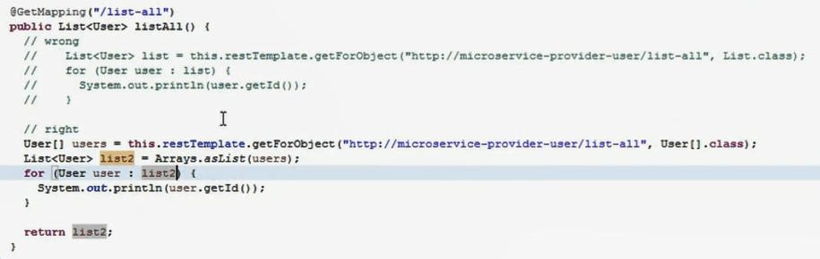

## SpringCloud练习

### 1、springcloud-a001-eureka-server

初识 Eureka Server，在 Spring Boot 环境下使用 **@EnableEurekaServer** 注解启动 Eureka Server 服务

### 2、springcloud-a002-provider-user、springcloud-a002-consumer-movie

基于 **RestTemplate** 实现的简单的服务生产者和服务消费者的案例：电影微服务调用用户微服务

用户微服务代码：

```java
@RestController
public class UserController {

    @Autowired
    private UserMapper userMapper;

    @GetMapping("/user/{id}")
    public User findById(@PathVariable Long id) {
        return userMapper.selectById(id);
    }
}
```

电影微服务代码：

```java
@RestController
public class MovieController {

    @Autowired
    private RestTemplate restTemplate;

    @Bean
    public RestTemplate restTemplate() {
        return new RestTemplate();
    }

    @GetMapping("/movie/{id}")
    public User findById(@PathVariable Long id) {
        return restTemplate.getForObject("http://localhost:7900/user/" + id, User.class);
    }
}
```

**数据库使用的是 H2，持久层框架使用的是 MyBatisPlus**

**RestTemple注意点**：



### 3、springcloud-a003

| springcloud-a003-parent         | Maven 父项目，抽取公共依赖 |
| ------------------------------- | -------------------------- |
| springcloud-a003-eureka-server  | Eureka 服务注册中心        |
| springcloud-a003-provider-user  | 用户微服务，服务提供者     |
| springcloud-a003-consumer-movie | 电影微服务，服务消费者     |

#### 将用户和电影微服务注册到 Eureka

**（1）添加依赖**

```html
<dependency>
    <groupId>org.springframework.cloud</groupId>
    <artifactId>spring-cloud-starter-eureka</artifactId>
    <version>1.4.4.RELEASE</version>
</dependency>
```

**（2）在 SpringBoot 启动类上添加注解 `@EnableEurekaClient`**

```java
import org.springframework.cloud.netflix.eureka.EnableEurekaClient;

@SpringBootApplication
@EnableEurekaClient
public class Application {
    public static void main(String[] args) {
        SpringApplication.run(Application.class, args);
    }
}
```

**（3）配置文件**

```yaml
eureka:
  client:
    serviceUrl:
      defaultZone: http://localhost:8761/eureka/	# Eureka Server 地址
  instance:
    instance-id: ${spring.application.name}:${spring.application.instance_id:${server.port}}	# 实例名称的显示格式（应用名称：端口号） 
    prefer-ip-address: true	# 允许通过 IP 访问，默认是通过主机名访问
```

> 拓展：配置显示 IP 地址 + 端口的形式
>
> ```yaml
> eureka:
>   instance:
>     instance-id: ${spring.cloud.client.ip-address}:${server.port}
>     prefer-ip-address: true
> ```

#### 获取服务地址、实例信息

```java
@Autowired
private EurekaClient eurekaClient;

@Autowired
private DiscoveryClient discoveryClient;

@GetMapping("/eureka-instance")
public String serviceUrl() {
    InstanceInfo instance = eurekaClient.getNextServerFromEureka("SPRINGCLOUD-A003-PROVIDER-USER", false);
    return instance.getHomePageUrl();
}

@GetMapping("/instance-info")
public ServiceInstance showInfo() {
    List<ServiceInstance> list = discoveryClient.getInstances("SPRINGCLOUD-A003-PROVIDER-USER");
    if (list != null && list.size() > 0 ) {
        return list.get(0);
    }
    return null;
}
```

#### 健康检查

添加依赖：

```html
<dependency>
    <groupId>org.springframework.boot</groupId>
    <artifactId>spring-boot-starter-actuator</artifactId>
</dependency>
```

健康检查配置：

```yaml
eureka:
  client:
    healthcheck:
      enabled: true	# 开启健康检查
```

#### 集成 spring-security 权限管理

集成后服务不能正常注册（原因待分析）

### 4、Ribbon

#### 解决 IP 和端口硬编码问题

```java
@RestController
public class MovieController {

    @Autowired
    private RestTemplate restTemplate;

    @GetMapping("/movie/{id}")
    public User findById(@PathVariable Long id) {

        // http://localhost:7900/user/  =>  http://springcloud-a003-provider-user/user/

        // VIP: virtual IP

        // 服务提供者的 ServiceId, 即服务提供者的 spring.application.name

        return restTemplate.getForObject("http://springcloud-a003-provider-user/user/" + id, User.class);
    }
}
```

#### 实现负载均衡的两种方式

- 服务器端负载均衡：Nginx 反向代理

- 客户端负载均衡：Ribbon 是客户端负载均衡的解决方案

#### 整合 Ribbon

**~~（0）添加依赖&nbsp;~~（spring-cloud-starter-eureka 中已经存在依赖）**

```html
<dependency>
    <groupId>org.springframework.cloud</groupId>
    <artifactId>spring-cloud-starter-netflix-ribbon</artifactId>
    <version>2.1.0.RELEASE</version>
</dependency>
```

**（1）在 RestTemplate 上添加注解 `@LoadBalanced`，使 RestTemplate 具备负载均衡的能力**

```java
@Bean
@LoadBalanced
public RestTemplate restTemplate() {
    return new RestTemplate();
}
```

#### 演示项目的操作

- 启动以下微服务项目

  > springcloud-a003-eureka-server
  >
  > springcloud-a003-provider-user
  >
  > springcloud-a004-provider-user
  >
  > springcloud-a004-consumer-movie

- 等待微服务全部注册到 Eureka Server `http://localhost:8761/`，访问电影微服务 `http://localhost:8010/movie/{id}` ，发现 Rubbon 会通过**轮询**的方式调用 a003 用户微服务和 a004 用户微服务。

#### 定制 Ribbon Client

设置负载均衡为**随机策略**

1、启动类添加注解

```java
@RibbonClient(name = "springcloud-a003-provider-user", configuration = TestConfiguratioon.class)
```

2、配置类

```java
@Configuration
public class TestConfiguratioon {
    
    @Bean
    @ConditionalOnMissingBean
    public IRule ribbonRule() {
        return new RandomRule();  // 设置负载均衡为随机策略
    }
}
```

注意：该类不应被 SpringBoot 扫描到，以免影响其他微服务分配策略（被扫描到，会修改所有微服务的调度策略）

方案一：该类不放在启动类及子目录中

方案二：使用自定义注解排除 SpringBoot 扫描配置类

> （1）自定义注解
>
> ```java
> public @interface ExcludeFromComponentScan {
> 
> }
> ```
>
> （2）在启动类 main 方法上添加包扫描的注解
>
> ```java
> @ComponentScan(excludeFilters = {
>         @ComponentScan.Filter(type = FilterType.ANNOTATION, value = ExcludeFromComponentScan.class)
> })
> ```
>
> （3）在配置类 `TestConfiguration` 上添加自定义注解 `ExcludeFromComponentScan`

### 5、Feign

**（1）添加依赖**

```html
<dependency>
    <groupId>org.springframework.cloud</groupId>
    <artifactId>spring-cloud-starter-openfeign</artifactId>
</dependency>
```

**（2）在 SpringBoot 启动类上添加注解 `@EnableFeignClients`**

**（3）新建接口，接口上使用注解 FeignClient**

```java
@FeignClient("springcloud-a005-provider-user")
public interface UserFeignClient {
    
    @GetMapping("/user/{id}")
    User findById(@PathVariable("id") Long id);
}
```

>  几个小坑：
>
>  1、GetMapping 、PostMapping 等组合注解不支持，需要使用 RequestMapping，并指定 Http 的 method（**新版本貌似已经支持**）
>
>  2、PathVariable 得设置 Value，省略会报错
>
>  3、只要参数是复杂对象，即使指定了 GET 请求方法，feign 依然会以 POST 方式发送请求（**新版本貌似已经不存在该问题**）
>
>  ```java
>  @FeignClient("springcloud-a005-provider-user")
>  public interface UserFeignClient {
>  
>      @RequestMapping(value = "/user/save", method = RequestMethod.GET)
>      User save(User user);
>  }
>  ```

### 6、Eureka 高可用

**Eureka Server 相互注册:**

```yml
spring:
  application:
    name: EUREKA-HA

---
server:
  port: 8761
spring:
  profiles: peer1
eureka:
  instance:
    hostname: localhost
  client:
    serviceUrl:
      defaultZone: http://localhost:8762/eureka/,http://localhost:8763/eureka/

---
server:
  port: 8762
spring:
  profiles: peer2
eureka:
  instance:
    hostname: localhost
  client:
    serviceUrl:
      defaultZone: http://localhost:8761/eureka/,http://localhost:8763/eureka/

---
server:
  port: 8763
spring:
  profiles: peer3
eureka:
  instance:
    hostname: localhost
  client:
    serviceUrl:
      defaultZone: http://localhost:8761/eureka/,http://localhost:8762/eureka/
```

**用户微服务同时注册到多个 Eureka Server 上面：**

```yml
eureka:
  client:
    serviceUrl:
      defaultZone: http://localhost:8761/eureka/,
      		   http://localhost:8762/eureka/, http://localhost:8763/eureka/
```

> 这里用户微服务只要注册到集群中的一个 Eureka Server 上，其他的 Eureka Server 通过心跳机制都可以获取到用户微服务的相关信息。配置多个 Eureka Server 节点为了服务稳定性。

### 7、Hystrix

**（1）消费者项目添加依赖**

```html
<dependency>
    <groupId>org.springframework.cloud</groupId>
    <artifactId>spring-cloud-starter-hystrix</artifactId>
    <version>1.4.6.RELEASE</version>
</dependency>
```

**（2）在消费者项目 SpringBoot 启动类上添加注解 `@EnableCircuitBreaker`**

**（3）示例代码：**

```java
@RestController
public class MovieController {

    @Autowired
    private RestTemplate restTemplate;

    @GetMapping("/movie/{id}")
    @HystrixCommand(fallbackMethod = "findByIdFallback")
    public User findById(@PathVariable Long id) {
        return restTemplate.getForObject("http://localhost:7900/user/" + id, User.class);
    }

    public User findByIdFallback(Long id) {
        User user = new User();
        user.setId(0L);
        return user;
    }
}
```

> 测试运行，启动以下子项目：
>
> springcloud-a003-eureka-server
>
> springcloud-a003-provider-user
>
> springcloud-a007-consumer-movie
>
> 当停止 springcloud-a003-provider-user 项目，请求 springcloud-a007-consumer-movie 项目，就会进入 Fallback 方法，多次请求就会发现 Hystrix 断路器打开。

### 8、`@HystrixProperty`

### 9、在 Feign 中使用 Hystrix

>springcloud-a003-eureka-server
>
>springcloud-a005-provider-user
>
>springcloud-a009-consumer-movie

### 10、Zuul

>springcloud-a003-eureka-server
>
>springcloud-a003-provider-user
>
>springcloud-a010-gateway-zuul

通过访问 Zuul 的服务地址 `http://localhost:8040/springcloud-a003-provider-user/user/1`，可以发现 Zuul 会对请求信息做反向代理。

服务地址配置：

```yaml
zuul:
  routes:
    # http://localhost:8040/springcloud-a003-provider-user/user/1
    # http://localhost:8040/user-service/user/1
    springcloud-a003-provider-user: /user-service/**
```

### 11、Sidecar

异构微服务

